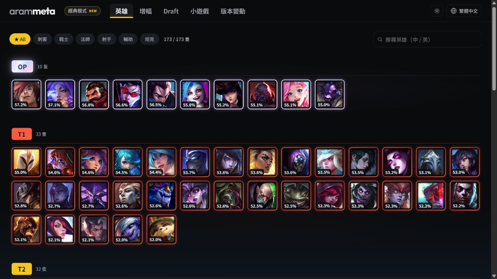
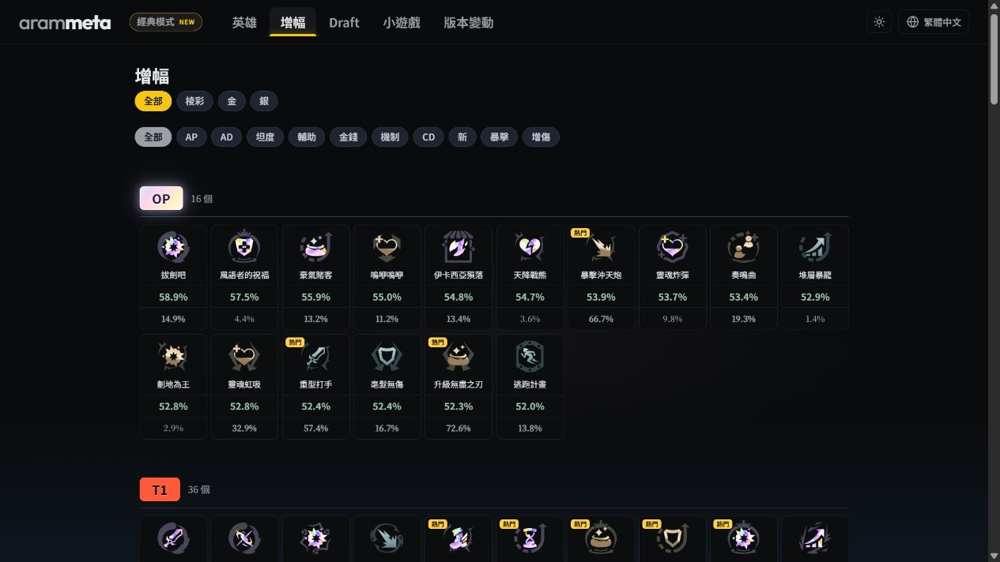
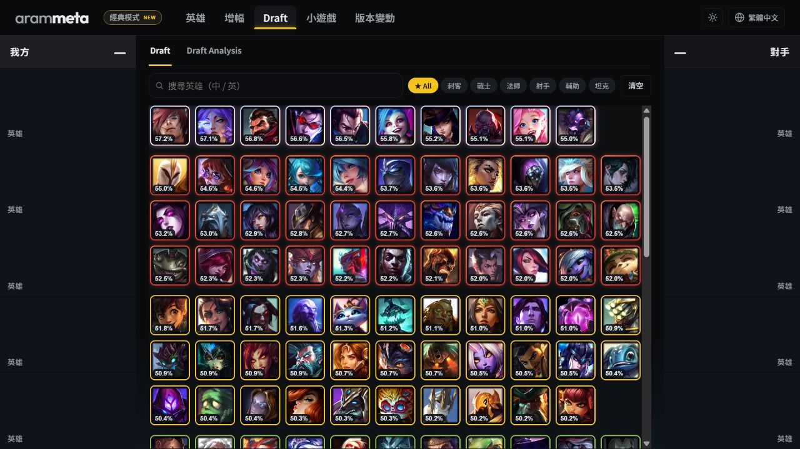
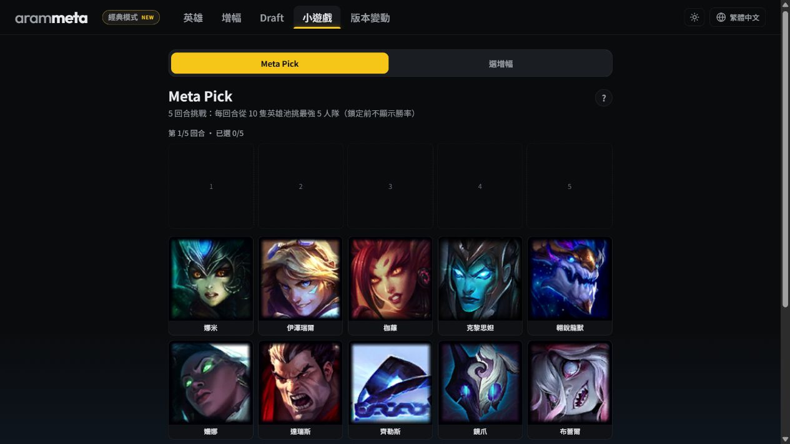
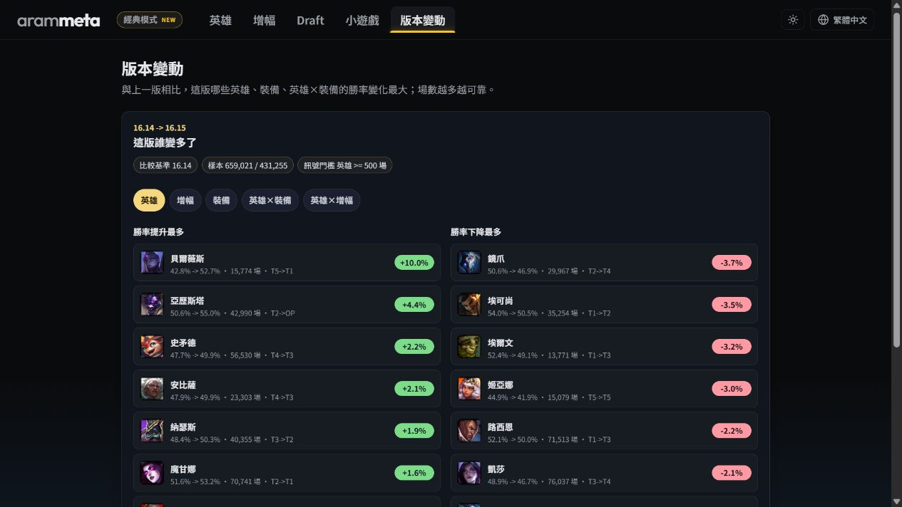

# arammeta

**League of Legends ARAM 大亂鬥（Mayhem）資料工具**

[開啟 arammeta](https://arammeta.com/) · [English](https://arammeta.com/en/) · [簡體中文](https://arammeta.com/zh-CN/)

arammeta 將實際對局整理成英雄、增幅與陣容資料，協助玩家比較選項。網站顯示的是特定版本與樣本範圍內的歷史統計，不是單場勝負保證。

## 網站怎麼用

- [英雄榜](https://arammeta.com/)：搜尋或篩選英雄，查看 Tier、調整後勝率、樣本數、推薦增幅與裝備。
- [增幅榜](https://arammeta.com/augments/)：依稀有度與類型比較增幅，點開後查看最適合的英雄。
- [Draft](https://arammeta.com/draft/)：選擇我方與敵方英雄；陣容未滿時取得補位建議，選滿後比較隊伍特性與估計勝率。
- [遊戲工具](https://arammeta.com/game/)：用 Meta Pick 練習選角，或用增幅 Draft 比較每輪候選。
- [版本變動](https://arammeta.com/changes/)：查看英雄與增幅在不同版本之間的變化。

閱讀任何數字時，請一起查看頁面標示的 queue、patch、樣本數、資料更新時間與限制。

## 功能預覽

點擊圖片即可開啟對應頁面。

<table>
  <tr>
    <td width="50%">
       
      <strong>英雄榜</strong> — Tier、勝率、搜尋與角色篩選
    </td>
    <td width="50%">
       
      <strong>增幅榜</strong> — 稀有度、類型與強度比較
    </td>
  </tr>
  <tr>
    <td colspan="2">
       
      <strong>Draft</strong> — 我方、候選池與對手的完整選角介面
    </td>
  </tr>
  <tr>
    <td width="50%">
       
      <strong>Meta Pick</strong> — 選角練習與增幅 Draft
    </td>
    <td width="50%">
       
      <strong>版本變動</strong> — 版本間的勝率與 Tier 變化
    </td>
  </tr>
</table>

## 資料怎麼來

Mayhem（queue `2400`）的完整對局不由 Riot 公開 API 提供，因此本專案透過玩家電腦上的 **League Client API（LCU）** 收集近期對局，並由種子玩家逐步擴展可查詢的對局範圍。

收進來的紀錄必須符合完整 5v5 結構，並以 Riot `game_id` 驗證與去重後，才會寫入私有 SQLite 資料庫。網站只發布去識別化的聚合統計，不公開 PUUID、Riot ID、召喚師名稱或 crawler frontier。英雄名稱、圖片與遊戲靜態資料另取自 Riot Data Dragon 與 [CommunityDragon](https://www.communitydragon.org/)。

想協助增加資料量，請看 [對局資料貢獻指南](CONTRIBUTING.md)。

## 更多細節

- [對局資料貢獻指南](CONTRIBUTING.md)
- [開發與常用指令](scripts/README.md)
- [本機收集服務與維運](OPERATIONS.md)
- [歷史產品與模型筆記](notes/archive/PRODUCT.md)

## Disclaimer

This project isn't endorsed by Riot Games and doesn't reflect the views or opinions of Riot Games or anyone officially involved in producing or managing League of Legends. League of Legends and Riot Games are trademarks or registered trademarks of Riot Games, Inc. League of Legends © Riot Games, Inc.

License: MIT.
